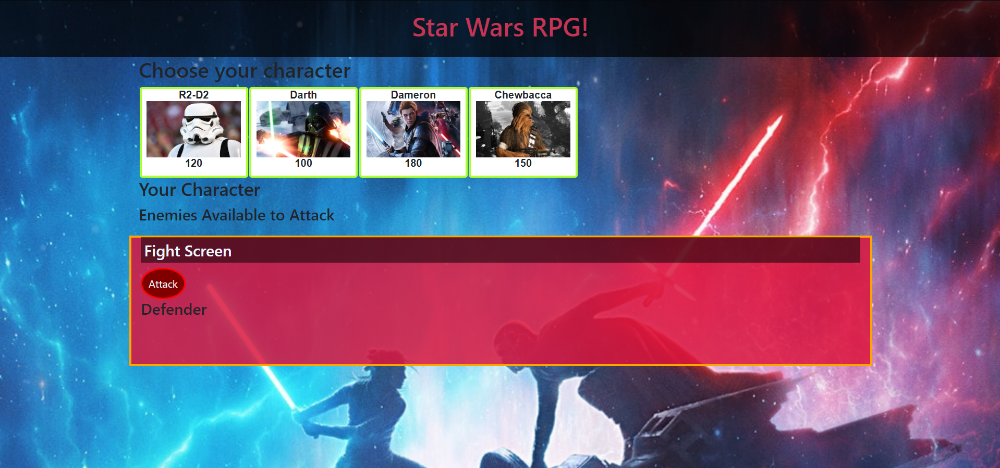
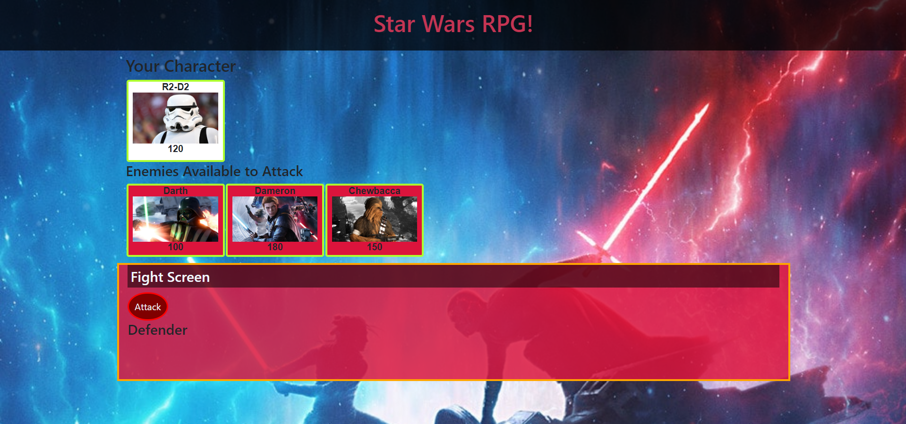
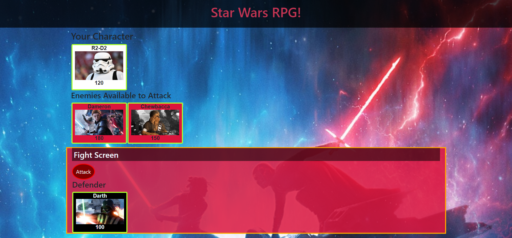

# Star Wars

## Overview
Web Application designed for a fun and interactive game for web browsers.

## Getting Started
These instructions will get you a copy of the project up and running on your local machine.

### Installing
Git clone the repository to your local machine:

HTTPS:
```
https://github.com/AmjedAyoub/Unit-4-Game.git
```
SSH:
```
git@github.com:AmjedAyoub/Unit-4-Game.git
```

## How the app works:

* When the game starts, the player will choose a character by clicking on the fighter's picture. The player will fight as that character for the rest of the game.

* The player must then defeat all of the remaining fighters. Enemies should be moved to a different area of the screen.

* The player chooses an opponent by clicking on an enemy's picture.

* Once the player selects an opponent, that enemy is moved to a `defender area`.

* The player will now be able to click the `attack` button.
    * Whenever the player clicks `attack`, their character damages the defender. The opponent will lose `HP` (health points). These points are displayed at the bottom of the defender's picture. 
    * The opponent character will instantly counter the attack. When that happens, the player's character will lose some of their `HP`. These points are shown at the bottom of the player character's picture.

* The player will keep hitting the attack button in an effort to defeat their opponent.

   * When the defender's `HP` is reduced to zero or below, remove the enemy from the `defender area`. The player character can now choose a new opponent.

* The player wins the game by defeating all enemy characters. The player loses the game the game if their character's `HP` falls to zero or below.

### Game notes

* Each character in the game has 3 attributes: `Health Points`, `Attack Power` and `Counter Attack Power`.

* Each time the player attacks, their character's Attack Power increases by its base Attack Power. 
  * For example, if the base Attack Power is 6, each attack will increase the Attack Power by 6 (12, 18, 24, 30 and so on).
* The enemy character only has `Counter Attack Power`. 

  * Unlike the player's `Attack Points`, `Counter Attack Power` never changes.

* The `Health Points`, `Attack Power` and `Counter Attack Power` of each character must differ.

* No characters in the game can heal or recover Health Points. 

  * A winning player must pick their characters wisely by first fighting an enemy with low `Counter Attack Power`. This will allow them to grind `Attack Power` and to take on enemies before they lose all of their `Health Points`. Healing options would mess with this dynamic.

* Your players should be able to win and lose the game no matter what character they choose. The challenge should come from picking the right enemies, not choosing the strongest player.

## Screenshots







## Technologies & Tools

* HTML  
* CSS
* JavaScript
* Bootstrap

## Links
This application is deployed on GitHub Pages, [Try it yourself](https://amjedayoub.github.io/Unit-4-Game).\
This application is published on [GitHub](https://github.com/AmjedAyoub/Unit-4-Game).

## Authors
See contribution history [here](https://github.com/AmjedAyoub/Unit-4-Game/graphs/contributors).

## Future updates
At the moment, this app is the minimum viable product. For future updates; improve the UI/UX, and add more functionality and features.